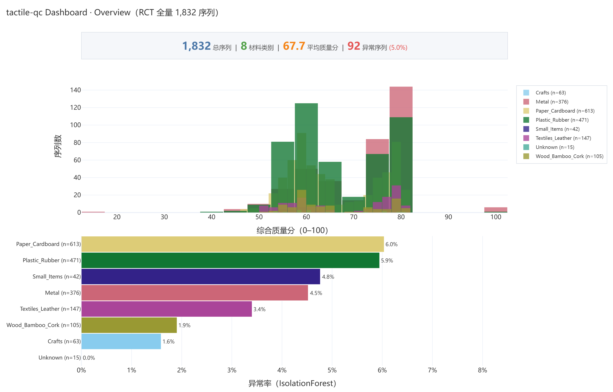
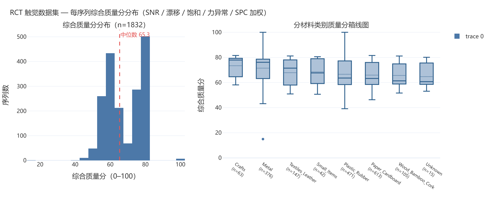

<div align="center">

# tactile-data-quality-inspector

**对机器人触觉数据做统计质量评估的命令行 + Dashboard 工具箱**

[](.github/workflows/ci.yml)
[](#安装)
[](#license)
[](https://pypi.org/project/tactile-qc/)

</div>

---

一句话定位：**把工业统计质量控制（SPC）和无监督异常检测搬到机器人触觉数据上——给每一条接触序列打一个 0–100 的质量分，并标出离群样本。**

## 为什么做这个项目

具身智能（embodied AI）的研究正把触觉传感器（DIGIT 等）当作"第二双眼睛"，但触觉数据有一个被严重低估的瓶颈：**数据质量本身没人系统性地审过**。

- 触觉帧是高维像素 + 力轨迹的混合信号，一次按压（press）就是一段时序。常见的数据集（如 RCT）动辄上万帧，研究者却很少在训练前做一次"这批数据能不能用"的体检。
- 通用 ML 数据清洗工具看不懂触觉信号——饱和、基线漂移、力突变这些**触觉特有的失效模式**不在它们的字典里。
- 统计过程控制（SPC）、X-bar 控制图、孤立森林这些方法本身很成熟，但需要有人把它们**适配到"逐帧像素 + 6 轴力"的形状**上，并给出可解释的指标。

这个项目做的就是这件事：五维质量指标（SNR / 基线漂移 / 饱和率 / 力异常 / SPC）+ 无监督异常检测（IsolationForest + Mahalanobis），输出自包含的 HTML 报告和可交互的 Streamlit Dashboard，让数据质量从"凭感觉"变成"看数字"。

## 截图

<div align="center">

**Streamlit Dashboard · Overview 页（基于真实全量数据复刻）**



**RCT 全量 1832 序列综合质量分分布**



</div>

## 安装

```bash
# 方式一：从 PyPI（发布后）
pip install tactile-qc

# 方式二：从源码（开发模式）
git clone https://github.com/<OWNER>/tactile-data-quality-inspector.git
cd tactile-data-quality-inspector
pip install -e ".[dev]"     # 含 pytest 等测试依赖
```

依赖：Python ≥ 3.10，numpy / pandas / scipy / scikit-learn / streamlit / plotly / click / pyyaml / pillow。

## 快速开始

### 一行 demo（无需任何数据集）

没有 RCT 数据集也能立刻看到效果——demo 脚本用合成数据（48 条序列，注入 8 条已知缺陷）跑完整流水线：

```bash
python examples/run_demo.py
```

预期输出：质量分中位数、Top-5 问题序列、IsolationForest 标记数与已知缺陷命中率（合成数据上通常 8/8）、两检测器一致性 Cohen's kappa，结果另存 `examples/demo_output/*.csv`。

### 真实数据（RCT 数据集）

```bash
# 探索性查看数据集结构
tactile-qc explore --data-dir ./data/rct/rct_dataset

# 跑全量质量评分 + 异常检测，输出到 reports/（默认自动并行，1832 序列）
tactile-qc run --data-dir ./data/rct --output-dir reports --format both

# 显式控制并行度：--workers 0=自动(核数一半，上限 8)、1=串行、N=N 进程
tactile-qc run --data-dir ./data/rct -j 8 --format both

# 启动交互式 Dashboard
streamlit run app.py
```

> 性能：质量评分与异常检测共享一次帧解码（单遍评估），并支持多进程并行。
> 在 8 核机器上，全量 1832 序列从约 16 分钟降至约 3–4 分钟；`--workers 1`
> 可回退到串行以复现逐位一致的结果。

产物：

| 文件 | 内容 |
|---|---|
| `reports/quality_scores.csv` | 每序列质量分 + 5 维指标 |
| `reports/anomaly_results.csv` | 每序列 IF / Mahalanobis 标签与得分 |
| `reports/quality_report.html` | 自包含 HTML 报告（可直接发邮件/挂网页） |
| `reports/anomaly_summary.md` | 异常检测结论摘要 |

## Key Findings（RCT 全量 1832 序列实测）

1. **质量分整体偏中低，长尾明显。** 综合质量分均值 67.7 / 中位数 65.3（0–100，相对评分），标准差 10.1；**32.5% 的序列低于 60 分**，仅 7.4% 达到 80 分以上。主要拖分项是 SNR（均值仅 18.6 dB，帧间噪声偏大）与力信号的 SPC 越限——说明触觉采集中的传感器噪声和力控稳定性是质量的主要瓶颈，而非硬件失效。

2. **硬件失效几乎为零，传感器标定良好。** 饱和率 > 0 的序列仅占 0.1%，基线漂移 |slope| > 1 的也仅 0.1%——DIGIT 传感器在采集期间没有出现大面积过曝/欠曝或亮度趋势性漂移，数据"能用"的硬件前提成立。这把质量问题的焦点从"坏数据"转移到了"噪声大的数据"。

3. **异常是个体离群，而非类别效应。** IsolationForest 标记 92 条（5.02%，与设定 contamination 一致），且这 92 条全部被 Mahalanobis 也标记（IF 是保守子集，Cohen's kappa = 0.615）。各材料类别间异常率无统计学显著差异（χ² 独立性检验 p = 0.363）——说明异常主要来自个别序列的离群行为，而不是某一类材料系统性地出问题。对一个无标注、无监督的质检任务来说，这正是期望的结果。

完整分析见 `reports/anomaly_summary.md`。

## 项目结构

```text
tactile-data-quality-inspector/
├── src/tactile_qc/
│   ├── io.py          # RCT 数据加载（material_categories + 力轨迹解析）
│   ├── quality.py     # 五维质量指标 + SPC + 综合评分
│   ├── anomaly.py     # PCA+力特征 → IsolationForest + Mahalanobis + 分层 χ²
│   ├── report.py      # 自包含 HTML 报告 + CSV 导出
│   └── cli.py         # tactile-qc run / explore 命令行
├── app.py             # Streamlit Dashboard（4 页）
├── tests/             # 72 个单元测试（合成数据，无数据集依赖）
├── examples/run_demo.py   # 合成数据 demo
├── .github/workflows/ci.yml
└── reports/           # 全量评分 + 报告产物
```

## 测试

```bash
pytest -v          # 72 passed；全部用合成数据，hermetic
```

覆盖：SNR 解析正确性、基线漂移线性拟合、SPC 三西格玛控制限、孤立森林在已知异常注入下的检测率与误报率、Mahalanobis 召回、多检测器 Cohen's kappa、端到端报告结构、单遍评估与多进程并行的串行一致性、进程池不可用时的串行降级。

## 引用

本项目对 RCT 数据集做质量评估，数据集与论文来自：

> Jingbo He, Michael Färber, Roberto Calandra. **RCT: A Robot-Collected Touch–Vision-Language Dataset for Tactile Generalization.** arXiv:2606.31694, 2026.
>
> - 项目主页: https://faerber-lab.github.io/RCT/
> - 代码: https://github.com/faerber-lab/RCT

如果你在研究中使用了本工具，请同时引用 RCT 数据集与本仓库。

## License

MIT。数据集本身遵循 RCT 原作者的许可条款，请遵守。
